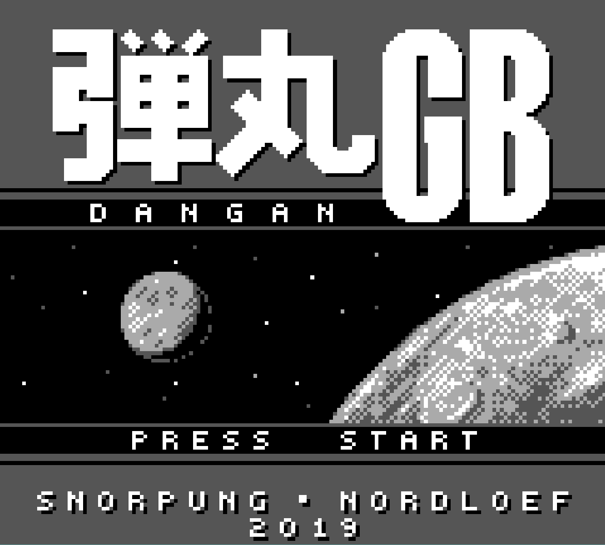
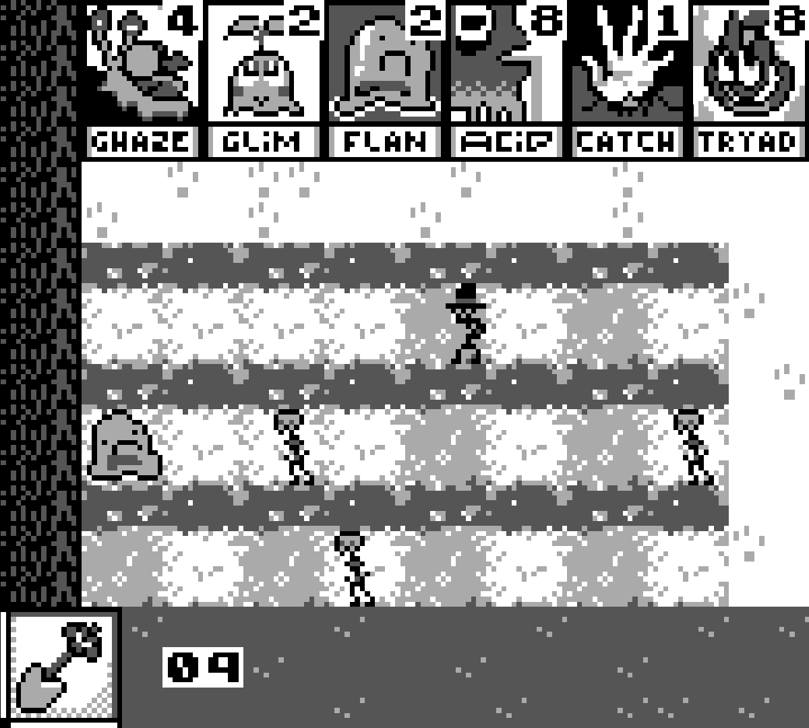
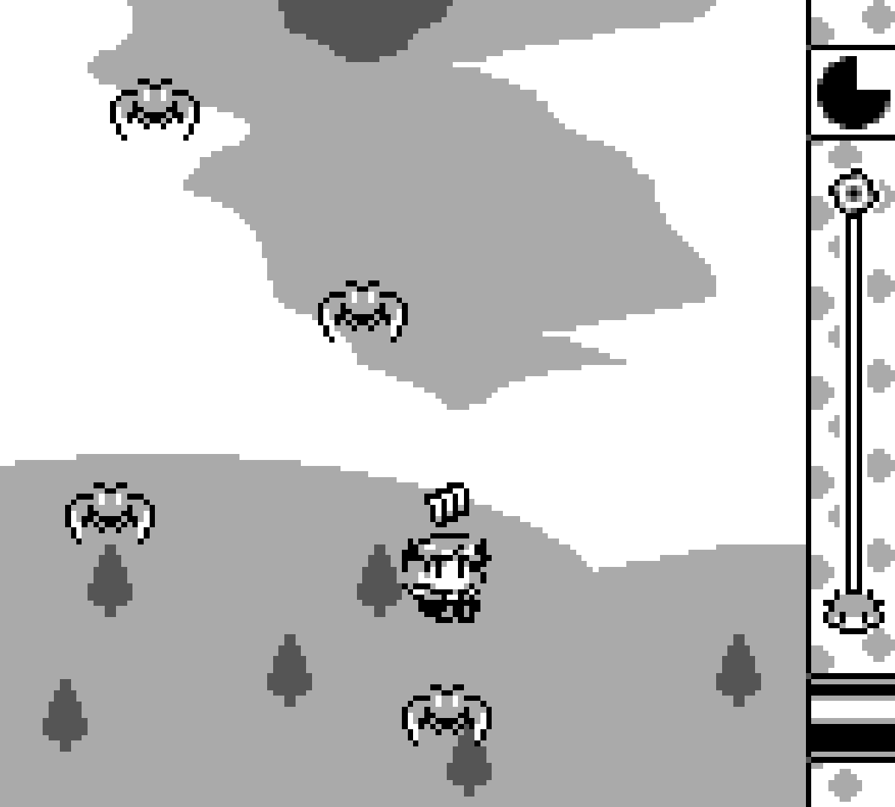

# RoToBoy

An accurate, low-level **GameBoy (DMG)** hardware emulator written from scratch. 

RoToBoy emulates the Sharp LR35902 8-bit CPU, pixel processing unit (PPU), timer system, interrupt controllers, and basic memory bank controllers (MBCs) to run homebrew games and hardware diagnostic test suites.

---

## 🎮 Gallery & Compatibility

RoToBoy supports unbanked (`MBC None`) and `MBC1` cartridges, passing standardized hardware accuracy tests while maintaining 60 FPS rendering.

| *DanganGB* | *Spiritfall* | *Tobu Tobu Girl* |
| :---: | :---: | :---: |
|  |  |  |
| **MBC None** • Bullet Hell | **MBC1** • Tower Defense | **MBC1** • Arcade Platformer |

---

## 🛠️ Architecture & Technical Features

* **Sharp LR35902 CPU Core:** 
  * Full implementation of the GameBoy's 8-bit instruction set (including 0xCB-prefixed opcodes).
  * Cycle-accurate fetch-decode-execute loop with cycle counting.
  * Register pairs (`AF`, `BC`, `DE`, `HL`) with full flag register (`Z`, `N`, `H`, `C`) evaluation.
* **Memory Architecture & Bus:**
  * Clean-room memory-mapped I/O handling (`0x0000–0xFFFF`).
  * Direct Memory Access (DMA) transfers from RAM to OAM.
  * Memory Bank Controller support (`MBC None`, `MBC1` with RAM banking support).
  * Built-in clean-room register initialization (bypasses proprietary boot ROM dependencies).
* **Graphics Engine (PPU):**
  * Scanline-based graphics renderer supporting Background, Window, and Sprite (OAM) layers.
  * Accurate PPU mode transitions (`Mode 0` H-Blank, `Mode 1` V-Blank, `Mode 2` OAM Search, `Mode 3` Pixel Transfer).
  * Support for 8x8 and 8x16 sprite tile sizes and palette swaps.
* **Timing & Interrupts:**
  * Hardware timer implementation (`DIV`, `TIMA`, `TMA`, `TAC` registers) driven by CPU clocks.
  * Interrupt Service Routine handling V-Blank, LCD Stat, Timer, Serial, and Joypad interrupts.

---

## 📊 Hardware Test Suite Compatibility

RoToBoy passes standardized GameBoy accuracy test ROMs:

- [x] **Blargg's CPU Instruction Tests** (`cpu_instrs.gb`)
- [x] **Blargg's Instruction Timing** (`instr_timing.gb`)
- [x] **Mooneye GB Test Suite** (`mbc1/` bank mapping & RAM enable tests)
- [x] **`dmg-acid2`** (PPU sprite priority and window rendering accuracy)

---

## 🚀 Building & Running

### Prerequisites

Ensure you have your compiler toolchain and standard graphics backend installed (e.g., SDL2, Raylib, or SFML depending on your build environment).

```bash
# Clone the repository
git clone https://github.com/your-username/RoToBoy.git
cd RoToBoy

# Build the emulator
mkdir build && cd build
cmake ..
make

# Run a homebrew ROM
./rotoboy path/to/rom.gb
```

---

## ⚖️ Disclaimer

*RoToBoy is an open-source educational project created for hardware emulation research. Game Boy is a registered trademark of Nintendo Co., Ltd. RoToBoy is not affiliated with, endorsed, or supported by Nintendo in any way. All screenshots shown in this repository feature open-source, publicly distributed homebrew software.*